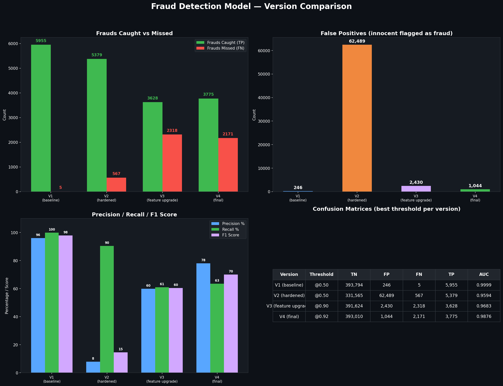

# Next-Generation AI Fraud Detection
Building a robust, explainable ML pipeline to catch stealthy banking fraud

---

## 🛑 The Challenge

Processing **2 Million Transactions** across 50,000 customers.

**The Goal:**
Catch sophisticated, modern fraud patterns *without* blocking legitimate transactions and angering customers.

**The Reality of Fraud:**
Fraudsters don't make it obvious. They blend in with normal behavior.

---

## 🚀 Our Iterative Journey

We didn't just build a model; we engineered a pipeline across four major iterations to conquer realistic fraud.

1. **V1: The Baseline** - Proving the concept
2. **V2: The Hardened Dataset** - Facing reality
3. **V3: Feature Engineering** - Fighting back with data
4. **V4: The Final Polish** - Optimizing for production

---

## 📉 V1 & V2: The Reality Check

**Version 1 (The Baseline):**
- Achieved **99.9% accuracy**.
- **The Catch:** The fraud was too obvious (e.g., massive midnight transactions).

**Version 2 (The Hardened Reality):**
- Introduced stealthy fraud: daytime hours, known devices, average amounts.
- **The Result:** The model collapsed. 
- **Impact:** It generated 62,489 False Positives. For every 1 fraud caught, it blocked 12 innocent customers.

---

## 🛠️ V3: Feature Engineering

We moved beyond raw data and started looking for *context*. 

Using **DuckDB** for massive-scale SQL transformations, we added new features:
- Transactions compared to user's median amounts
- Balance drops before and after
- Device risk flags
- City location mismatch

**Result:** False positives dropped from 62,489 to **2,430**.

---

## 🏆 V4: The Final Production Model

We pushed all logic into a clean SQL pipeline and optimized the XGBoost model.

**Advanced Interaction Features:**
- `zscore_x_device`: Unusual amount + risky device
- `rapid_drain`: Fast transactions + high balance drop
- `sus_combo`: High zscore + wrong city

**Model Upgrades:** 
4x Fraud oversampling, 800 trees, strict regularization.

**Final Result:** 1,044 False Positives (a 98% reduction from V2!)

---

## 📊 The Results

A clear path from a failing model to a production-ready system.

By Version 4, we reduced the noise by 98% while maintaining strong detection capabilities.

---

## 🤖 The Explainer: LangChain Fraud Assistant

A score of 0.92 means "Fraud", but **why**?

We built a local LLM assistant using **LangChain** and **Llama 3.1 (8B)** to act as an AI Fraud Analyst.

**How it works:**
1. Evaluates the transaction and XGBoost score.
2. Reads the deep SQL feature data.
3. Generates a **plain English explanation** for investigators.

---

## 🕵️ AI Assistant in Action

**Action: ALLOW (Score: 0.00)**

*Why this looks safe:*
> "The transaction appears normal and legitimate."

*Suspicious points:*
> "Account has made 47 transactions... Average amount is $3937, slightly higher than median."

*Final Recommendation:*
> "ALLOW the transaction. Suspicious points are not significant enough to warrant blocking."

---

## 💡 Key Takeaways

1. **Data over Algorithms:** Raw data isn't enough. Feature engineering via SQL (DuckDB) was the key to catching stealthy fraud.
2. **False Positives Matter:** High accuracy means nothing if you block thousands of innocent customers.
3. **Explainable AI:** Using LLMs alongside traditional ML (XGBoost) bridges the gap between cold numbers and human understanding.

---

# Thank You
